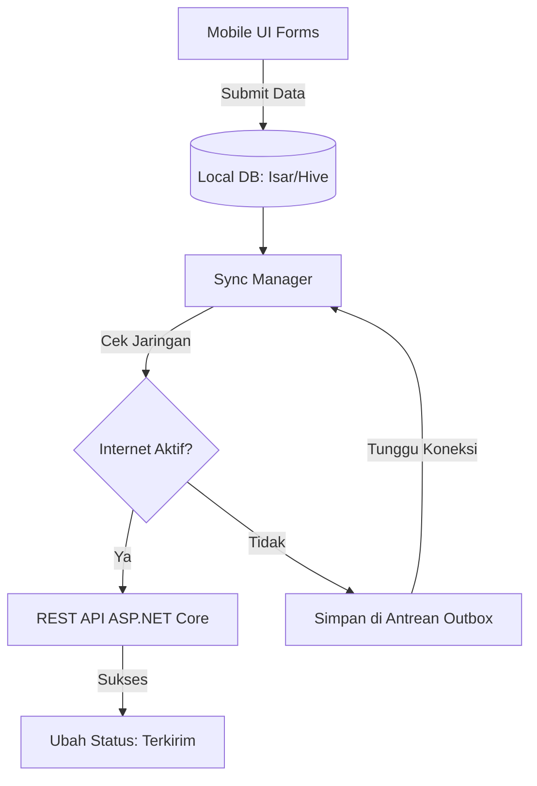
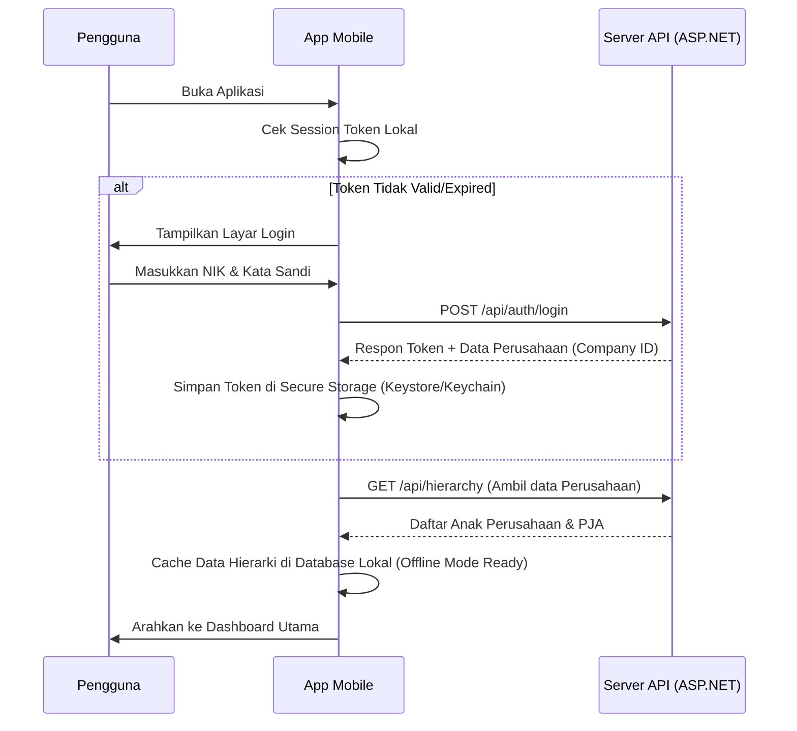
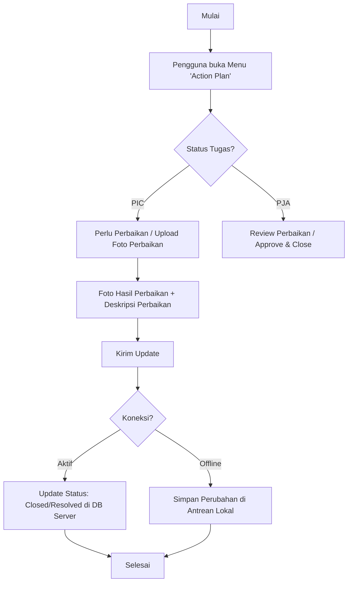
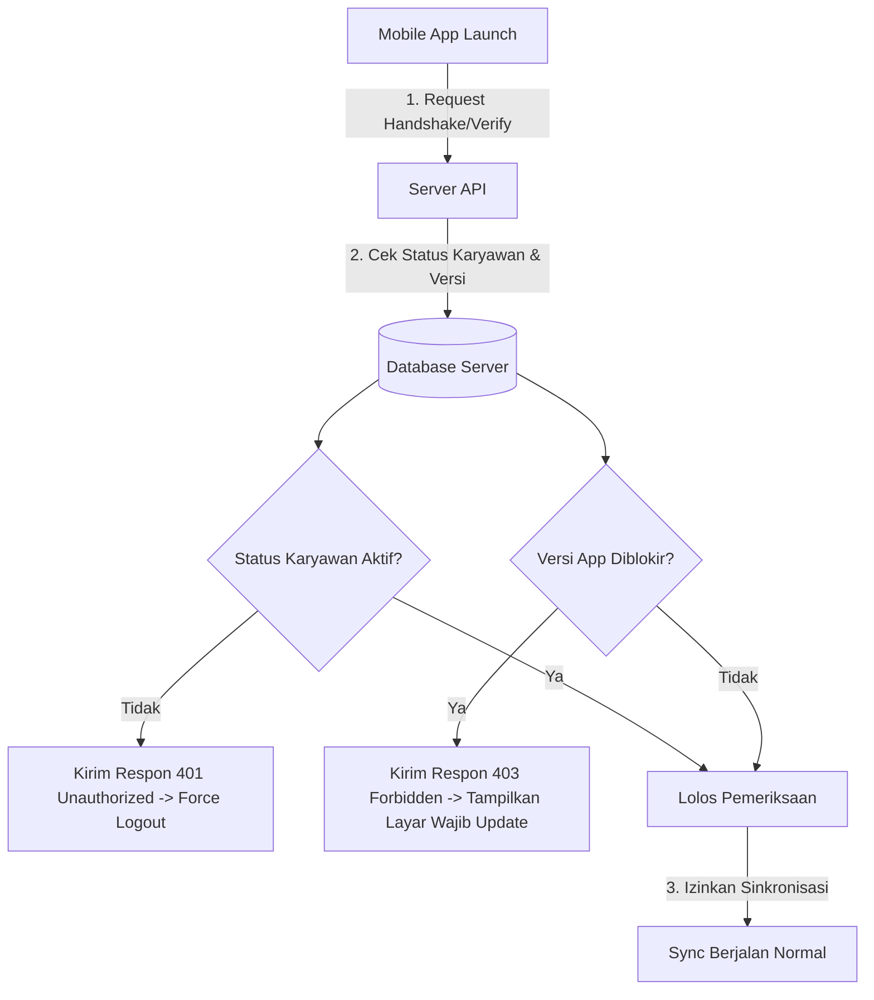

# Rencana Pengembangan Aplikasi Mobile MBS SAP

Dokumen ini mendokumentasikan perencanaan, arsitektur, pilihan teknologi, dan alur sistem (flow) untuk pengembangan aplikasi mobile **MBS SAP** yang diadaptasi dari platform web saat ini.

---

## 1. Pilihan Teknologi (Tech Stack)

Untuk efisiensi pengembangan lintas platform (iOS & Android) dan dukungan perangkat keras (kamera & GPS), berikut opsi teknologi yang direkomendasikan:

| Komponen | Pilihan Utama (Rekomendasi) | Opsi Alternatif | Alasan |
| :--- | :--- | :--- | :--- |
| **Framework** | **Flutter (Dart)** | React Native (TS) | Performa UI 60fps yang konsisten, manajemen memori efisien, dan rendering native engine Skia/Impeller. |
| **Local Database** | **Hive / Isar** | SQLite (Room/Sqflite) | NoSQL lokal berkecepatan sangat tinggi untuk mendukung penyimpanan offline (offline-first). |
| **API Client** | **Dio** | Http | Mendukung interceptor untuk refresh token dan caching request. |
| **State Management** | **Bloc / Riverpod** | Provider | Sangat terstruktur untuk memisahkan logika bisnis (BLoC) dari UI. |

---

## 2. Arsitektur Offline-First (Sangat Krusial)

Mengingat wilayah tambang sering kali memiliki keterbatasan jaringan internet (poor connection/blind spot), aplikasi mobile dirancang dengan pendekatan **Offline-First**.

---

## 3. Alur Pengguna (User Flow)

### 3.1. Alur Autentikasi & Pengaturan Awal

---

### 3.2. Alur Pelaporan SAP (Hazard, Inspeksi, P5M, Safety Talk, Coaching, Observasi)
Alur ini berlaku seragam untuk semua tab pelaporan, didukung penyimpanan otomatis saat offline:

1. **Langkah 1: Pengisian Form**
   - Pengguna memilih jenis laporan (misal: *Hazard*).
   - Pengisian tanggal (default hari ini) dan waktu (default jam sekarang).
   - Memilih Area, Lokasi, Detil Lokasi (data diambil dari cache lokal).
2. **Langkah 2: Lampiran Foto (Camera / Gallery)**
   - Mengambil foto temuan secara langsung menggunakan modul kamera handphone atau memilih dari galeri.
   - Kompresi gambar otomatis (maks. 1-2 MB) untuk menghemat bandwidth.
3. **Langkah 3: Pengisian Detail & PJA/PIC**
   - Menulis deskripsi temuan, tindakan perbaikan, kategori bahaya.
   - Memilih PJA (Penanggung Jawab Area) dan PIC dari daftar dropdown.
4. **Langkah 4: Pengiriman / Simpan Draf**
   - Menekan tombol **Kirim**.
   - Aplikasi mendeteksi jaringan:
     - **Online**: Kirim langsung ke server API.
     - **Offline**: Simpan sebagai antrean draf lokal (Outbox). Notifikasi draf ditunjukkan di dashboard.

---

### 3.3. Alur Verifikasi & Tindak Lanjut (Action Plan) oleh PIC/PJA

---

## 4. Struktur Endpoint API yang Dibutuhkan (Backend Integration)

Untuk mendukung aplikasi mobile, backend ASP.NET Core perlu menyediakan/mengoptimalkan endpoint REST API berikut:

1. **Autentikasi**
   - `POST /api/auth/login` (Verifikasi NIK dan Password, mengembalikan JWT Token & User Profile).
2. **Master Data Cache**
   - `GET /api/hierarchy/companies` (Mendapatkan hierarki perusahaan yang diakses user).
   - `GET /api/master/employees` (Mendapatkan daftar karyawan untuk PJA/PIC).
   - `GET /api/master/locations` (Daftar Area, Lokasi, dan Kategori Bahaya).
3. **Sinkronisasi Transaksi (Bulk Upload)**
   - `POST /api/sync/hazard` (Mengunggah data Hazard secara individu/bulk).
   - `POST /api/sync/inspection` (Mengunggah laporan Inspeksi).
   - `POST /api/sync/safetytalk` (Mengunggah Laporan Safety Talk).
   - `POST /api/sync/p5m` (Mengunggah laporan P5M).
   - `POST /api/sync/coaching` (Mengunggah laporan Coaching).
   - `POST /api/sync/observation` (Mengunggah laporan Observasi).
4. **Media Upload**
   - `POST /api/media/upload` (Mengunggah foto temuan/perbaikan secara terpisah dengan return URL gambar).

---

## 5. Rencana Tahapan Rilis (Milestones)

### Fase 1: Inisiasi & Desain UI/UX (Minggu 1-2)
- Pembuatan High-Fidelity UI Mockup untuk Android dan iOS.
- Struktur database lokal (Schema design).

### Fase 2: Fitur Inti & Offline Storage (Minggu 3-6)
- Integrasi modul Kamera, GPS lokasi, dan Local DB (Isar/Hive).
- Pembuatan form-form dinamis (Hazard & Inspeksi).

### Fase 3: Integrasi API & Sync Manager (Minggu 7-9)
- Pengembangan REST API endpoint di ASP.NET Core backend.
- Logika sinkronisasi otomatis (Background Sync Job).

### Fase 4: Pengujian & Rilis (Minggu 10-12)
- Uji coba lapangan (UAT) di blind spot area tambang.
- Publikasi ke Google Play Store (Internal/Closed Beta Testing) dan Apple TestFlight.

---

## 6. Manajemen Akses & Keamanan dari Sisi Server (Server-Side Access Control)

Karena aplikasi mobile didistribusikan secara eksternal (menggunakan file APK/IPA atau rilis Store), diperlukan mekanisme pengamanan dan pemblokiran akses terpusat langsung dari Dashboard Web Server (Admin Panel). 

### 6.1. Mekanisme Kontrol Akses Server-Side

### 6.2. Fitur Keamanan pada Web Dashboard Admin
Administrasi via halaman `/Admin/Index` web saat ini perlu dikembangkan fitur manajemen mobile sebagai berikut:

1. **User Active/Inactive Toggle (Tombol Nonaktifkan User)**:
   - Jika status karyawan diatur ke `Inactive` (tidak aktif) pada server, seluruh token JWT di handphone otomatis ditolak (kembali `401 Unauthorized`).
   - Aplikasi mobile akan otomatis melakukan **force logout** dan menghapus seluruh local draf/cache jika menerima kode respon tersebut.
2. **Device / Mobile Session Management (Manajemen Sesi Perangkat)**:
   - Dashboard Admin menampilkan daftar perangkat aktif (Device ID, tipe HP, NIK user, dan tanggal login terakhir).
   - Admin dapat mengeklik tombol **"Revoke Access" / "Putuskan Sesi"** untuk menghapus validitas token perangkat tersebut (misalnya jika HP hilang atau user resign).
3. **App Version & Kill Switch (Kendali Versi Aplikasi)**:
   - Halaman administrasi web dapat mengatur versi aplikasi minimum (misalnya versi `1.2.0`).
   - Jika pengguna masih membuka aplikasi versi lama (misalnya `1.1.0`), server akan menolak sinkronisasi API dan mengembalikan instruksi **Wajib Update**.
   - UI aplikasi mobile langsung menampilkan layar blokir dengan tautan unduh APK/Update Store yang baru.

---

## 7. Desain Estetika & Tema UI (UI Aesthetics & Theme)

Untuk memberikan kesan yang bersih, profesional, dan konsisten dengan aplikasi web, desain visual aplikasi mobile mengikuti panduan estetika berikut:

- **Tema Utama: Light Mode (Clean White)**:
  - Tampilan pertama saat pengguna membuka aplikasi dan masuk ke layar login **wajib menggunakan tema terang/putih** (Light Mode), bukan tema gelap (Dark Mode).
  - Background utama menggunakan warna putih bersih atau abu-abu sangat muda (misal: `#FFFFFF` atau `#F8FAFC`).
- **Skema Warna Aksen (Accent Colors)**:
  - Menggunakan warna biru korporat profesional (misal: `#0284c7` atau `#005691`) untuk tombol utama, header, dan elemen navigasi aktif, selaras dengan identitas visual MBS SAP Web.
  - Teks utama menggunakan warna abu-abu gelap/hitam (misal: `#0F172A` atau `#1E293B`) untuk memastikan keterbacaan yang tinggi (*high contrast*).
- **Aesthetic Card Design**:
  - Pelaporan di dashboard SafeFeed menggunakan desain card dengan batas halus (*subtle borders*) atau bayangan tipis (*soft shadows*) untuk memberikan kedalaman native mobile yang premium.

